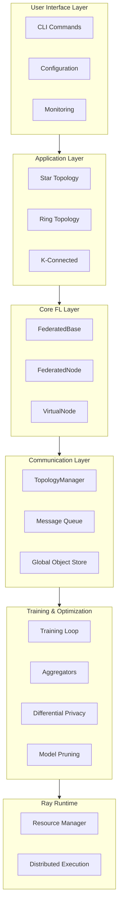
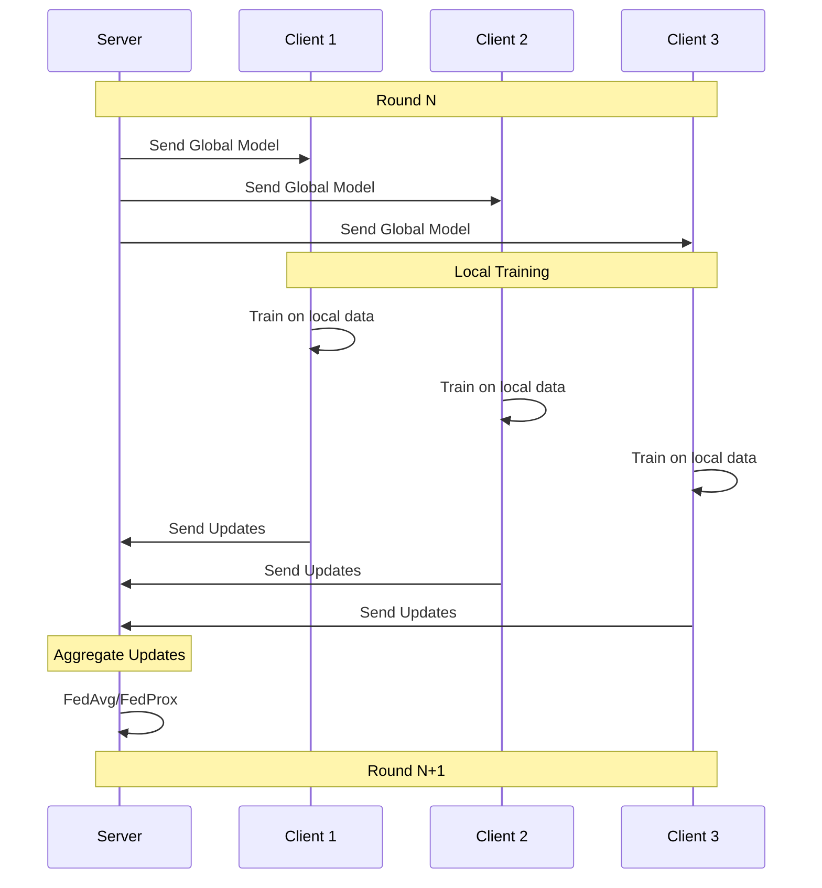
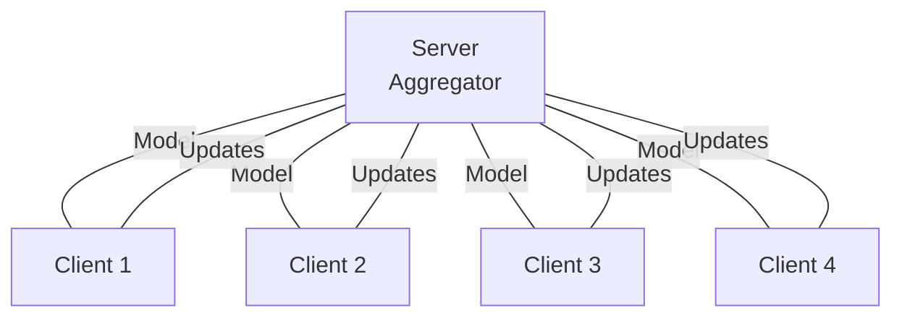
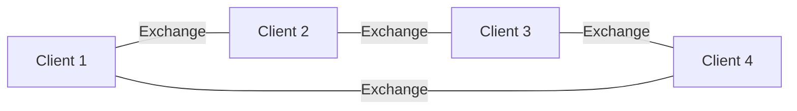
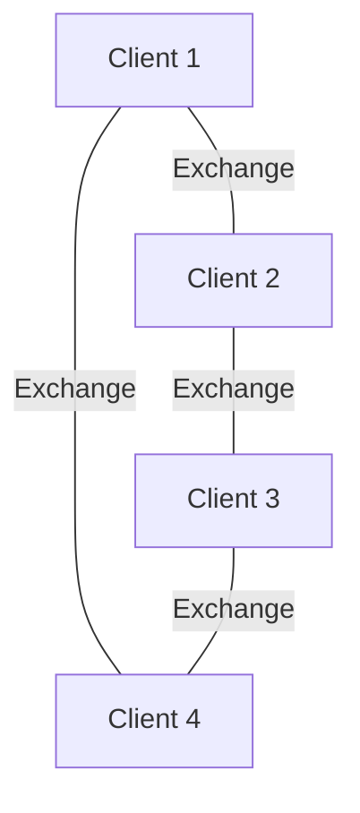

# FedPilot Framework Overview

FedPilot is an open-source federated learning framework built on Ray for scalable distributed machine learning. It enables organizations to train machine learning models collaboratively while preserving data privacy.

Repository: [github.com/fedpilot/core](https://github.com/fedpilot/core)

---

## What is FedPilot?

Federated Learning (FL) is a machine learning paradigm where:
- Training data remains **distributed across multiple locations**
- Each participant trains locally on their own data
- Only model updates are shared with other participants
- A global model is built without centralizing data

FedPilot provides a **complete platform** for implementing federated learning systems, from research experiments to production deployments.

---

## Core Features

### Federated Learning Architectures
- **Centralized FL (Star Topology)**: Traditional server-client architecture
- **Decentralized FL (Ring/K-Connected)**: Peer-to-peer collaboration without central server


### Supported Models
- **Vision**: CNN, LeNet, ResNet-18/50, VGG-16, MobileNet, Vision Transformer (ViT), Swin
- **NLP**: BERT, ALBERT
- **Custom Models**: Full support for user-defined models

### Available Datasets
- **Image**: MNIST, Fashion-MNIST, FEMNIST, CIFAR-10/100, SVHN, STL-10, Tiny ImageNet
- **Text**: Shakespeare, BBC News, Yahoo QA
- **Custom Datasets**: Support for proprietary data

### Optimization & Privacy
- **Aggregation Strategies**: FedAvg (IID), FedProx (heterogeneous data)
- **Differential Privacy**: DP-SGD implementation with privacy budgets
- **Model Compression**: Pruning, quantization, enhanced chunking
- **Advanced Techniques**: Gradient clipping, client sampling, secure aggregation

---

## Architecture Overview

FedPilot follows a layered architecture:



---

## Key Components

### FederatedBase
Central coordinator that:
- Manages all federated nodes
- Initializes and manages topology
- Orchestrates training rounds
- Handles resource allocation

### FederatedNode
Individual participant that:
- Loads and trains on local data
- Computes model updates
- Participates in aggregation
- Reports metrics

### VirtualNode
Lazy-initialized wrapper providing:
- Resource efficiency for large deployments
- Automatic conversion to FederatedNode on first use
- Scalability to thousands of participants

### TopologyManager
Communication coordinator handling:
- Network connectivity
- Message routing
- Dynamic topology adaptation
- Round synchronization

---

## Communication Flow



---

## Data Privacy Model

FedPilot protects data privacy through:

1. **Local Training**: Data never leaves client machines
2. **Gradient Aggregation**: Only model updates are shared
3. **Differential Privacy**: Optional DP-SGD adds noise to gradients
4. **Secure Aggregation**: Encrypted gradient aggregation
5. **Client Sampling**: Random selection of participants per round

### Privacy Guarantees

With Differential Privacy enabled:
- Epsilon (ε): Privacy budget spent
- Delta (δ): Probability of privacy breach
- Example: ε=1.0, δ=1e-5 provides strong privacy


---

## Use Cases

### Research
- Federated learning algorithm development
- Privacy-preserving model training
- Non-IID data analysis
- Aggregation strategy testing

### Enterprise
- Collaborative model training across organizations
- On-device model training
- Privacy-compliant machine learning
- Regulatory compliance (GDPR, HIPAA, etc.)

### Mobile & Edge
- Federated learning on edge devices
- Mobile model training
- IoT data processing
- Real-time model updates

### Healthcare & Finance
- Patient data privacy protection
- Financial institution collaboration
- Regulatory requirement compliance
- Sensitive data protection

---


## Federated Learning Architectures

### 1. Centralized (Star Topology)



**Characteristics:**
- Central server coordinates
- All-to-one communication pattern
- Synchronous training rounds
- Ideal for traditional FL

### 2. Decentralized (Ring Topology)



**Characteristics:**
- No central server
- Peer-to-peer communication
- Gossip-based aggregation
- Resilient to failures

### 3. K-Connected Topology



**Characteristics:**
- Each client connected to K neighbors
- Flexible communication pattern
- Balanced gossip-style aggregation
- Scalable mesh network


**Characteristics:**
- Ray cluster with head and workers
- Task-based distributed training
- Elastic scalability
- Production-ready monitoring

---

## Aggregation Strategies

### FedAvg (Federated Averaging)
Best for: IID (independent and identically distributed) data

```
global_model = sum(client_updates * client_data_size) / total_data_size
```

### FedProx (Federated Proximal)
Best for: Non-IID data and system heterogeneity

```
loss = local_loss + (mu/2) * ||local_model - global_model||²
```

---

## Privacy Features

### Differential Privacy Levels

| Privacy Level | Epsilon | Use Case |
|---|---|---|
| Minimal | ε > 10 | Research/Testing |
| Standard | 1 < ε < 10 | Most applications |
| Strong | ε < 1 | Highly sensitive data |
| Maximum | ε < 0.1 | Medical/Financial data |

### Privacy Techniques
- DP-SGD with gradient clipping
- Noise injection
- Secure aggregation
- Client sampling

---

## Integration & Extensibility

### Built-in Support
- **PyTorch**: Native PyTorch models
- **Ray**: Distributed computing
- **OpenTelemetry**: Observability
- **Prometheus/Grafana**: Monitoring

### Custom Extensions
- Custom models
- Custom datasets
- Custom aggregation strategies
- Custom topologies
- Custom loss functions

---

## Performance Characteristics

### Scalability
- Supports 10s to 1000s of clients
- Linear scaling with client count
- Ray cluster scaling

### Communication Efficiency
- Model update compression
- Gradient pruning
- Selective aggregation

### Computation
- Local training: PyTorch-based
- Aggregation: Vectorized operations
- Ray tasks for parallelization

### Memory
- VirtualNode for lazy initialization
- Efficient gradient storage
- Configurable batch sizes

---

## Monitoring & Observability

### Metrics Collected
- Training accuracy and loss
- Communication overhead
- Model convergence
- Privacy budget consumption
- Resource utilization

### Available Tools
- Prometheus: Metric collection
- Grafana: Visualization
- Jaeger: Distributed tracing
- OpenTelemetry: Instrumentation

---

## Key References

### Federated Learning Papers
- "Communication-Efficient Learning of Deep Networks from Decentralized Data" (FedAvg)
- "Federated Optimization in Heterogeneous Networks" (FedProx)
- "Learning Differentially Private Recurrent Language Models" (DP-SGD)

### Technologies
- **Ray**: Distributed computing framework
- **PyTorch**: Deep learning library
- **OpenTelemetry**: Observability standard

---

## Next Steps

1. Read [Getting Started]({{ site.baseurl }}/getting-started) for first training
2. Review [Installation]({{ site.baseurl }}/installation) for setup
3. Explore [Architecture Overview]({{ site.baseurl }}/architecture/overview) for system design
4. Check [Examples]({{ site.baseurl }}/examples/basic-training) for practical implementations
5. Visit [GitHub Repository](https://github.com/fedpilot/core) for source code

---

## License & Citation

For licensing and citation information, see the [GitHub repository](https://github.com/fedpilot/core).

---

## Community & Support

- GitHub Issues: [Report bugs](https://github.com/fedpilot/core/issues)
- Discussions: [Ask questions](https://github.com/fedpilot/core/discussions)
- Documentation: [Wiki](./README.md)