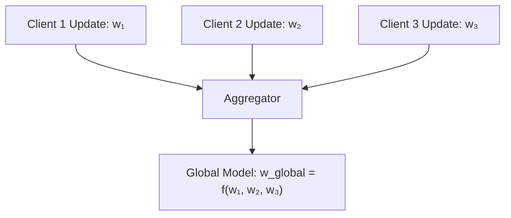
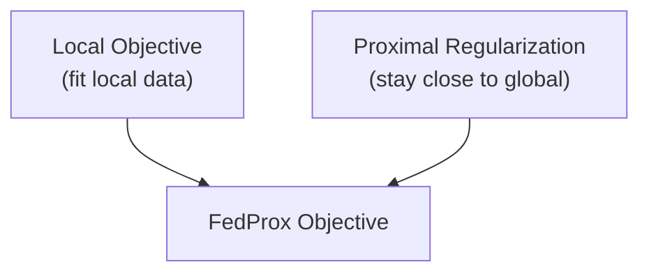
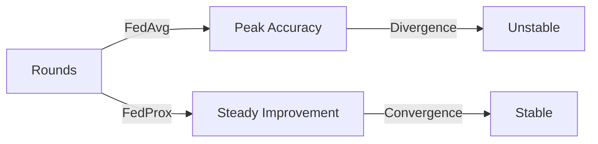
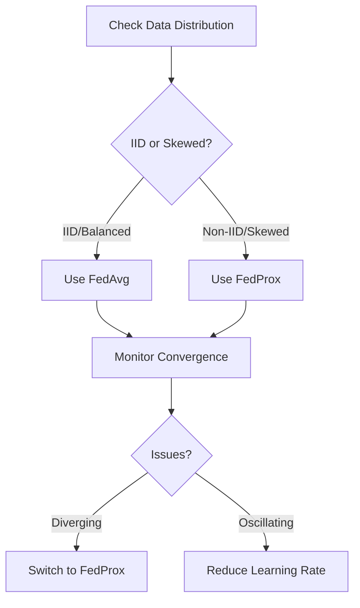

# Aggregation Strategies Guide

Comprehensive guide to model aggregation strategies in federated learning.

## What is Aggregation?

Aggregation combines model updates from multiple clients into a single global model:



---

## FedAvg (Federated Averaging)

Standard averaging aggregation algorithm.

### Formula

```
w_global = Σ(n_i / N) × w_i

where:
- n_i = number of samples on client i
- N = total samples
- w_i = model weights from client i
```

### Configuration

```yaml
aggregation_strategy: "FedAvg"
fed_avg: true
```

### Characteristics

- Simple and effective
- Works well with IID data
- Fast convergence (IID case)
- Struggles with non-IID data
- Can diverge under heterogeneity

### Usage Example

```python
from src.core.aggregator.fed_avg_aggregator_base import FedAvgAggregator

aggregator = FedAvgAggregator()

# Aggregate client updates
updates = [client1_update, client2_update, client3_update]
weights = [0.3, 0.3, 0.4]  # Based on data sizes

aggregated = aggregator.aggregate(updates, weights)
```

### When to Use

- IID or nearly-IID data
- Balanced client data
- Baseline experiments
- Well-behaved convergence expected

### Performance

```yaml
# Example configuration
aggregation_strategy: "FedAvg"
data_distribution_kind: "20"      # Low non-IID
number_of_clients: 10
federated_learning_rounds: 50
```

**Expected Results:**
- Good convergence with IID data
- Accuracy: 90-95% (MNIST)
- Convergence rounds: 50-100

---

## FedProx (Federated Proximal)

Addresses non-IID challenges with proximal term.

### Formula

```
minimize_w Σ F_i(w) + μ/2 × ||w - w_global||²

where:
- F_i(w) = local loss on client i
- μ = proximal coefficient
- w_global = global model
```

### Intuition

Adds regularization term to keep local models close to global model:



### Configuration

```yaml
aggregation_strategy: "FedProx"
fed_avg: false

# Optional: Proximal coefficient (default varies)
# fedprox_mu: 0.01
```

### Characteristics

- Handles non-IID data better
- Stable with heterogeneous data
- Converges with heterogeneity
- Additional hyperparameter (μ)
- Slightly slower than FedAvg

### Usage Example

```python
from src.core.aggregator.fed_prox_aggregator_base import FedProxBase

aggregator = FedProxBase(mu=0.01)

# Aggregate with proximal term
aggregated = aggregator.aggregate(
    updates=updates,
    weights=weights,
    global_model=w_global
)
```

### When to Use

- Highly non-IID data
- Unbalanced client data
- Heterogeneous client environments
- Need stable convergence

### Performance

```yaml
# Example configuration for non-IID
aggregation_strategy: "FedProx"
data_distribution_kind: "90"      # High non-IID
number_of_clients: 20
federated_learning_rounds: 100
```

**Expected Results:**
- Better convergence with non-IID
- Accuracy: 85-90% (non-IID CIFAR-10)
- More stable training

---

## Comparison

### Convergence Behavior



### Feature Comparison

| Feature | FedAvg | FedProx |
|---------|--------|---------|
| IID Data | Excellent | Excellent |
| Non-IID Data | Poor | Good |
| Stability | Can diverge | Stable |
| Hyperparameters | 0 | 1 (μ) |
| Computation | Fast | Slightly Slower |
| Implementation | Simple | Complex |

### Accuracy vs Non-IID Level

| Non-IID Level | FedAvg | FedProx |
|---------------|--------|---------|
| IID | 100% | 100% |
| 20% | 92% | 95% |
| 50% | 85% | 90% |
| 90% | 75% | 88% |

---

## Configuration Examples

### Example 1: IID Data with FedAvg

```yaml
aggregation_strategy: "FedAvg"
fed_avg: true

data_distribution_kind: "iid"
number_of_clients: 10
federated_learning_rounds: 50

model_type: "resnet18"
dataset_type: "cifar10"
```

### Example 2: Non-IID Data with FedProx

```yaml
aggregation_strategy: "FedProx"
fed_avg: false

data_distribution_kind: "90"
number_of_clients: 20
federated_learning_rounds: 100

model_type: "resnet18"
dataset_type: "cifar10"
```

### Example 3: Highly Heterogeneous

```yaml
aggregation_strategy: "FedProx"
fed_avg: false

data_distribution_kind: "90"
dirichlet_beta: 0.01        # Very non-IID
number_of_clients: 50
federated_learning_rounds: 200

model_type: "resnet50"
dataset_type: "cifar100"
```

---

## Best Practices

### Choosing Strategy



---

## Resources

- **[Configuration Guide]({{ site.baseurl }}/configuration-guide)**: Full config reference
- **[Basic Examples]({{ site.baseurl }}/examples/basic-training)**: Practical examples
- **[Models & Datasets]({{ site.baseurl }}/guides/models-and-datasets)**: Available models

---

**Next:** Explore [Basic Examples]({{ site.baseurl }}/examples/basic-training) to get more familiar with the concepts of federated learning.
{: .text-center }